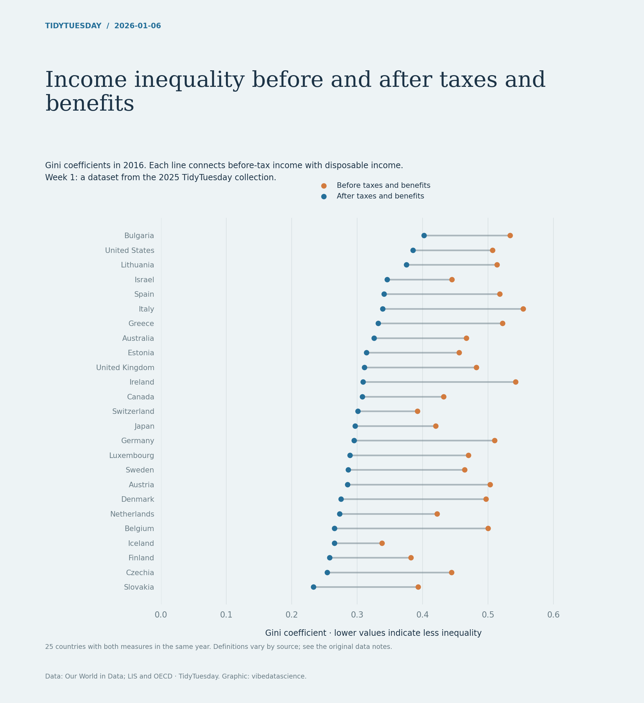

# Income inequality before and after taxes and benefits

[Python code](20260106.py) · [Source dataset](https://github.com/rfordatascience/tidytuesday/tree/main/data/2025/2025-08-05)

Bring-your-own-data week uses the 2025-08-05 TidyTuesday dataset. Choose the common year from 2015 onward with the most paired observations (earliest year wins a tie). Plot all available countries in that year. Gini measures follow the published harmonised dataset; definitions can vary.

Data: Our World in Data; LIS and OECD. Chart: vibedatascience.

Inputs (original CSV files, losslessly gzip-compressed): [income_inequality_processed.csv.gz](data/income_inequality_processed.csv.gz)
