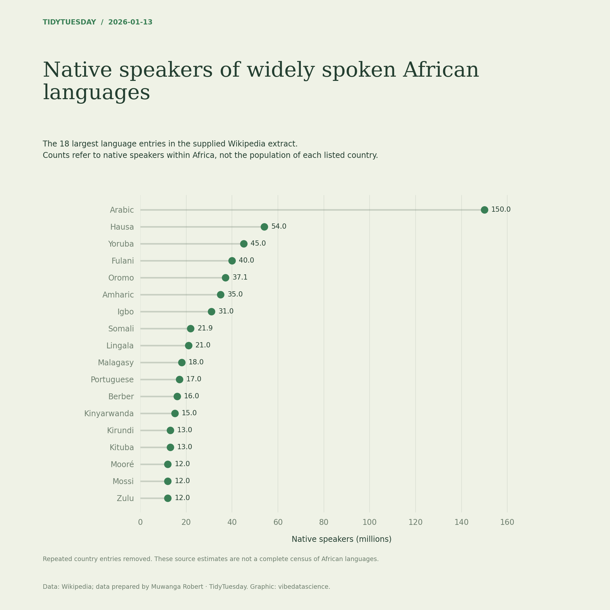

# Native speakers of widely spoken African languages

[Python code](20260113.py) · [Source dataset](https://github.com/rfordatascience/tidytuesday/tree/main/data/2026/2026-01-13)

Deduplicate language/family/speaker-count tuples before ranking: country rows repeat Africa-wide counts, while some different language entries share a name. The 18 displayed entries have unique names. Do not sum across countries. Source extraction prepared by Muwanga Robert (CC BY).

Data: Wikipedia; data prepared by Muwanga Robert. Chart: vibedatascience.

Inputs (original CSV files, losslessly gzip-compressed): [africa.csv.gz](data/africa.csv.gz)
