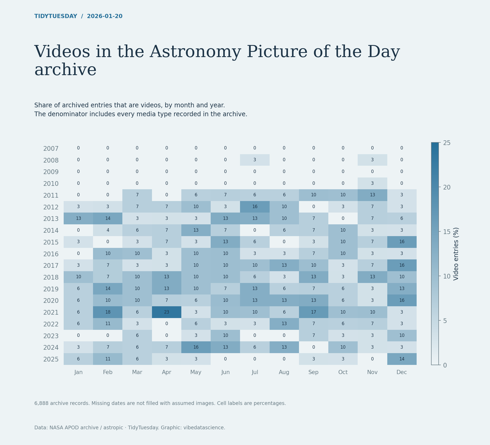

# Videos in the Astronomy Picture of the Day archive

[Python code](20260120.py) · [Source dataset](https://github.com/rfordatascience/tidytuesday/tree/main/data/2026/2026-01-20)

Monthly video share = video records / all archived records in that month. Dates are checked for uniqueness. No missing date is treated as an image. Only metadata is used; no APOD images are copied.

Data: NASA APOD archive / astropic. Chart: vibedatascience.

Inputs (date and media_type columns from apod.csv; gzip-compressed): [apod.csv.gz](data/apod.csv.gz)
