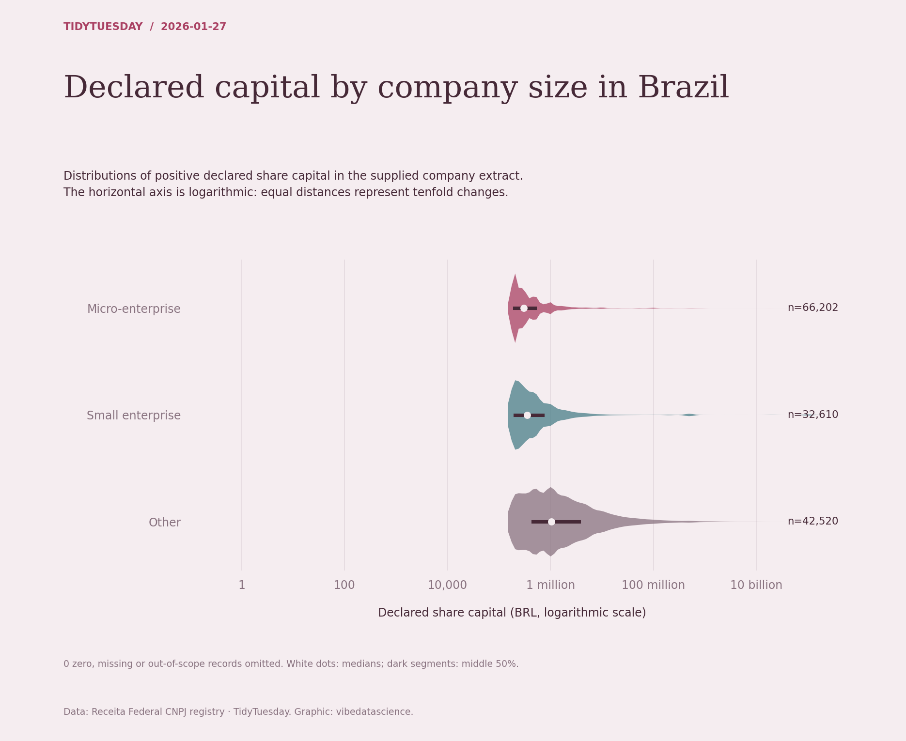

# Declared capital by company size in Brazil

[Python code](20260127.py) · [Source dataset](https://github.com/rfordatascience/tidytuesday/tree/main/data/2026/2026-01-27)

Use positive declared capital values only. Violin density is estimated on log10 capital; median and quartiles use the same transformed scale. Companies are the supplied registry extract, not a census or measure of current firm value.

Data: Receita Federal CNPJ registry. Chart: vibedatascience.

Inputs (original CSV files, losslessly gzip-compressed): [companies.csv.gz](data/companies.csv.gz)
