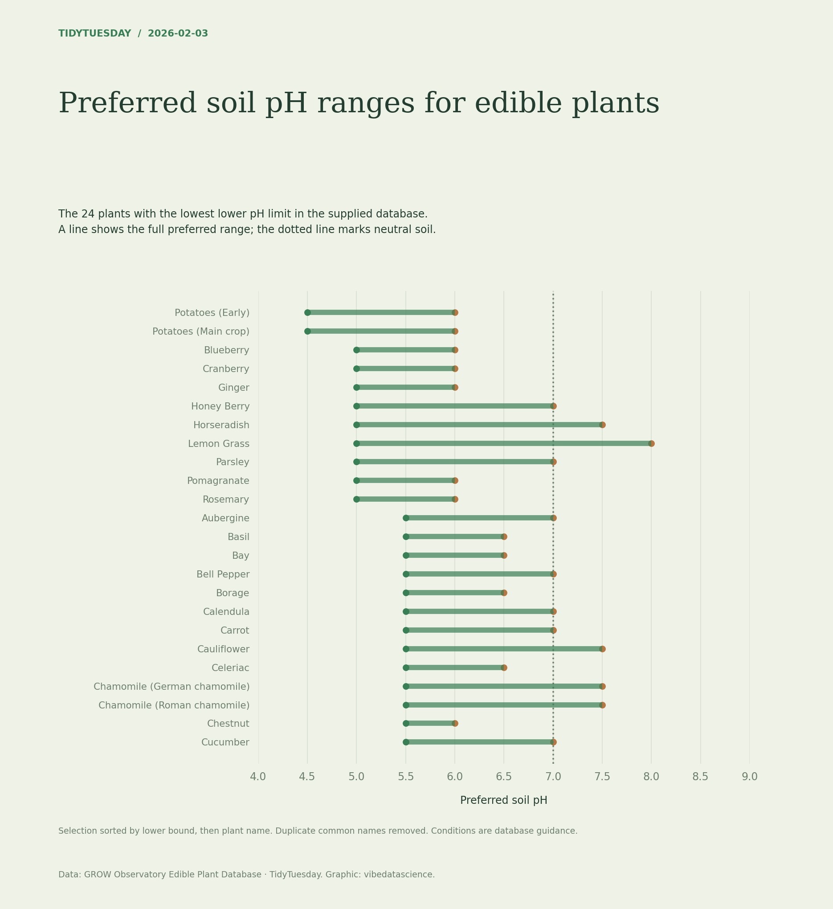

# Preferred soil pH ranges for edible plants

[Python code](20260203.py) · [Source dataset](https://github.com/rfordatascience/tidytuesday/tree/main/data/2026/2026-02-03)

Complete pH intervals only; verify lower ≤ upper. Deduplicate common names and take the 24 with the lowest lower limit, with alphabetical tie-breaking. Ranges are growing guidance, not measured yield responses.

Data: GROW Observatory Edible Plant Database. Chart: vibedatascience.

Inputs (original CSV files, losslessly gzip-compressed): [edible_plants.csv.gz](data/edible_plants.csv.gz)
