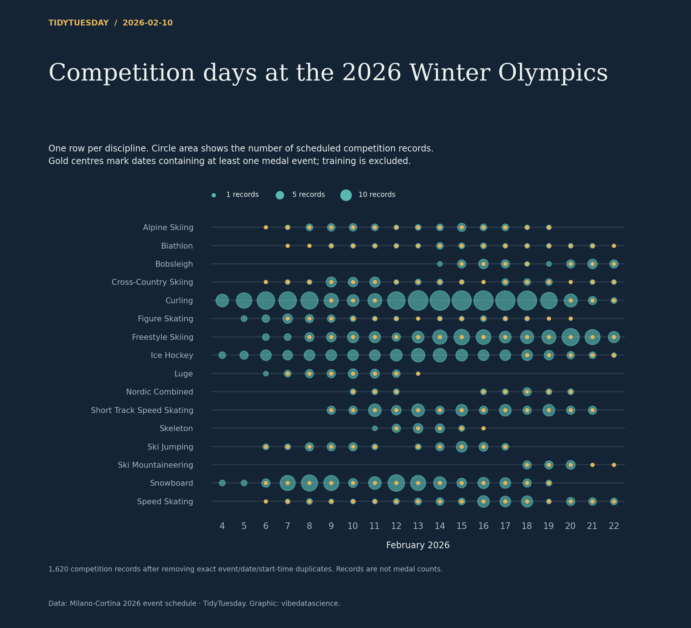

# Competition days at the 2026 Winter Olympics

[Python code](20260210.py) · [Source dataset](https://github.com/rfordatascience/tidytuesday/tree/main/data/2026/2026-02-10)

Exclude training, deduplicate event/date/start-time records, count remaining records per discipline/date. Circle area scales with records. Gold indicates at least one medal-marked record, not the number of medals awarded.

Data: Milano-Cortina 2026 event schedule. Chart: vibedatascience.

Inputs (original CSV files, losslessly gzip-compressed): [schedule.csv.gz](data/schedule.csv.gz)
