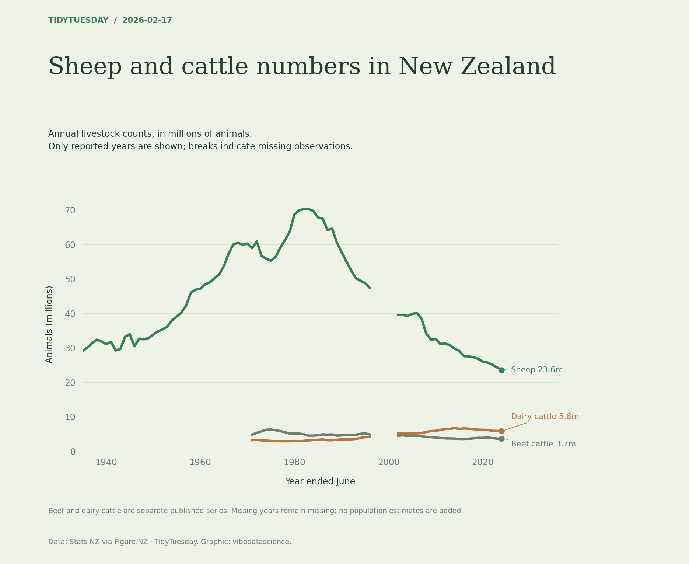

# Sheep and cattle numbers in New Zealand

[Python code](20260217.py) · [Source dataset](https://github.com/rfordatascience/tidytuesday/tree/main/data/2026/2026-02-17)

Use the three named livestock series, preserving missing years as gaps. Counts shown in millions. Do not sum total cattle with its component series.

Data: Stats NZ via Figure.NZ. Chart: vibedatascience.

Inputs (original CSV files, losslessly gzip-compressed): [dataset.csv.gz](data/dataset.csv.gz)
