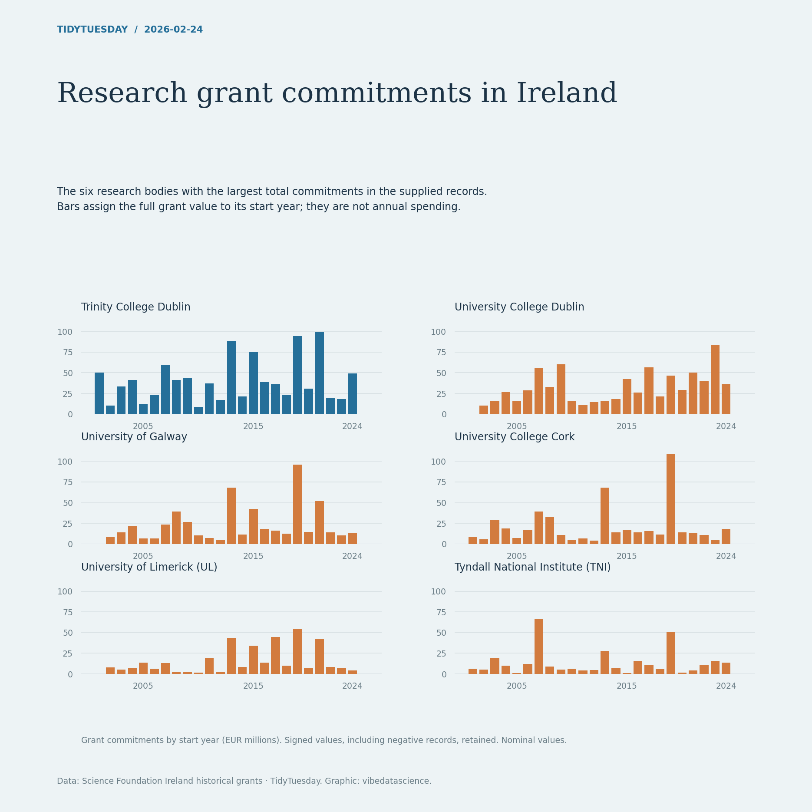

# Research grant commitments in Ireland

[Python code](20260224.py) · [Source dataset](https://github.com/rfordatascience/tidytuesday/tree/main/data/2026/2026-02-24)

Rank research bodies by total current commitment, then sum by start year for the top six. Preserve supplementary awards and negative commitment records as supplied; these are signed/net recorded totals. These are full grant commitments assigned to start years, not cash disbursements or inflation-adjusted expenditure.

Data: Science Foundation Ireland historical grants. Chart: vibedatascience.

Inputs (original CSV files, losslessly gzip-compressed): [sfi_grants.csv.gz](data/sfi_grants.csv.gz)
