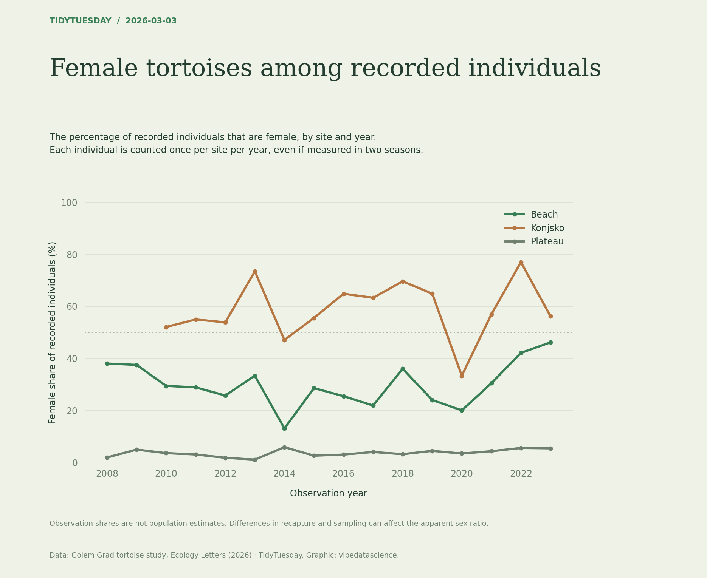

# Female tortoises among recorded individuals

[Python code](20260303.py) · [Source dataset](https://github.com/rfordatascience/tidytuesday/tree/main/data/2026/2026-03-03)

Deduplicate individual/year/site before computing female shares. Plot all sites on a 0–100% scale with gaps for missing years. This describes recorded individuals, not population sex ratios or a causal mechanism.

Data: Golem Grad tortoise study, Ecology Letters (2026). Chart: vibedatascience.

Inputs (original CSV files, losslessly gzip-compressed): [tortoise_body_condition_cleaned.csv.gz](data/tortoise_body_condition_cleaned.csv.gz)
