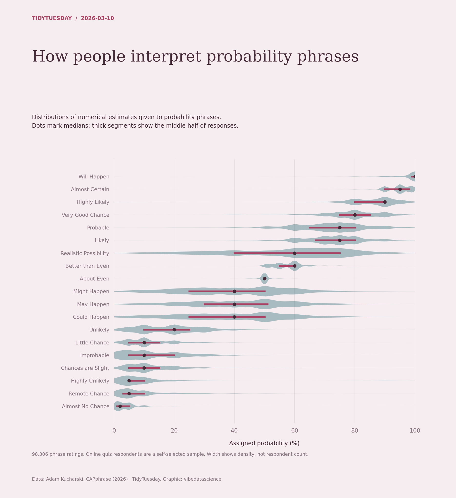

# How people interpret probability phrases

[Python code](20260310.py) · [Source dataset](https://github.com/rfordatascience/tidytuesday/tree/main/data/2026/2026-03-10)

Use all nonmissing numerical phrase ratings (0–100). Sort phrases by median. Violin width is a within-phrase density estimate; quartiles and medians are empirical. Respondents are self-selected.

Data: Adam Kucharski, CAPphrase (2026). Chart: vibedatascience.

Inputs (original CSV files, losslessly gzip-compressed): [absolute_judgements.csv.gz](data/absolute_judgements.csv.gz)
