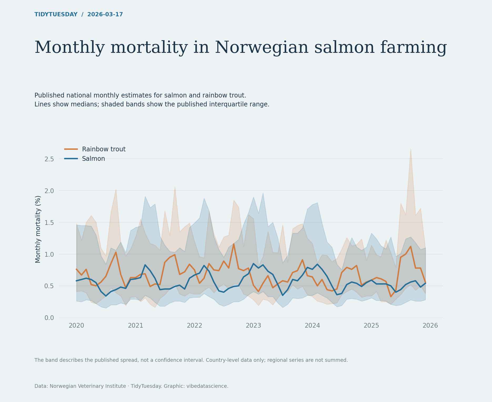

# Monthly mortality in Norwegian salmon farming

[Python code](20260317.py) · [Source dataset](https://github.com/rfordatascience/tidytuesday/tree/main/data/2026/2026-03-17)

Use only geo_group=country and region=Norge. Draw published median and q1–q3, preserving species distinction. The interval is not a confidence interval and monthly percentages are not annualised.

Data: Norwegian Veterinary Institute. Chart: vibedatascience.

Inputs (original CSV files, losslessly gzip-compressed): [monthly_mortality_data.csv.gz](data/monthly_mortality_data.csv.gz)
