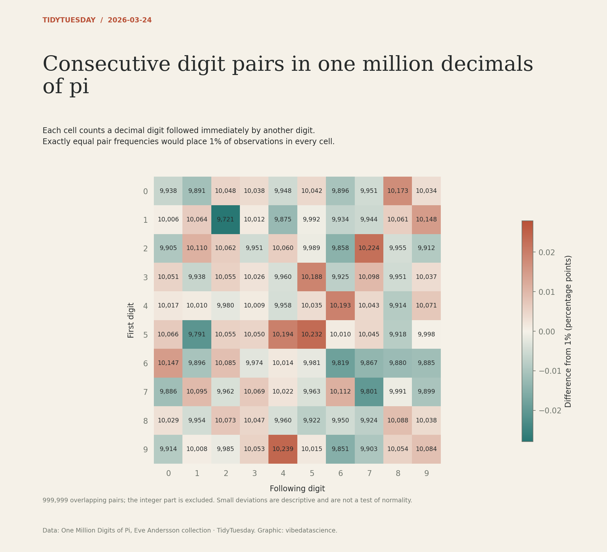

# Consecutive digit pairs in one million decimals of pi

[Python code](20260324.py) · [Source dataset](https://github.com/rfordatascience/tidytuesday/tree/main/data/2026/2026-03-24)

Exclude the first digit (integer 3); count overlapping pairs of the one million decimal digits. Assert exactly 999,999 pairs. Cell labels are counts; colour is the percentage-point deviation from 1%, centred on zero. No claim of statistical significance.

Data: One Million Digits of Pi, Eve Andersson collection. Chart: vibedatascience.

Inputs (original CSV files, losslessly gzip-compressed): [pi_digits.csv.gz](data/pi_digits.csv.gz)
