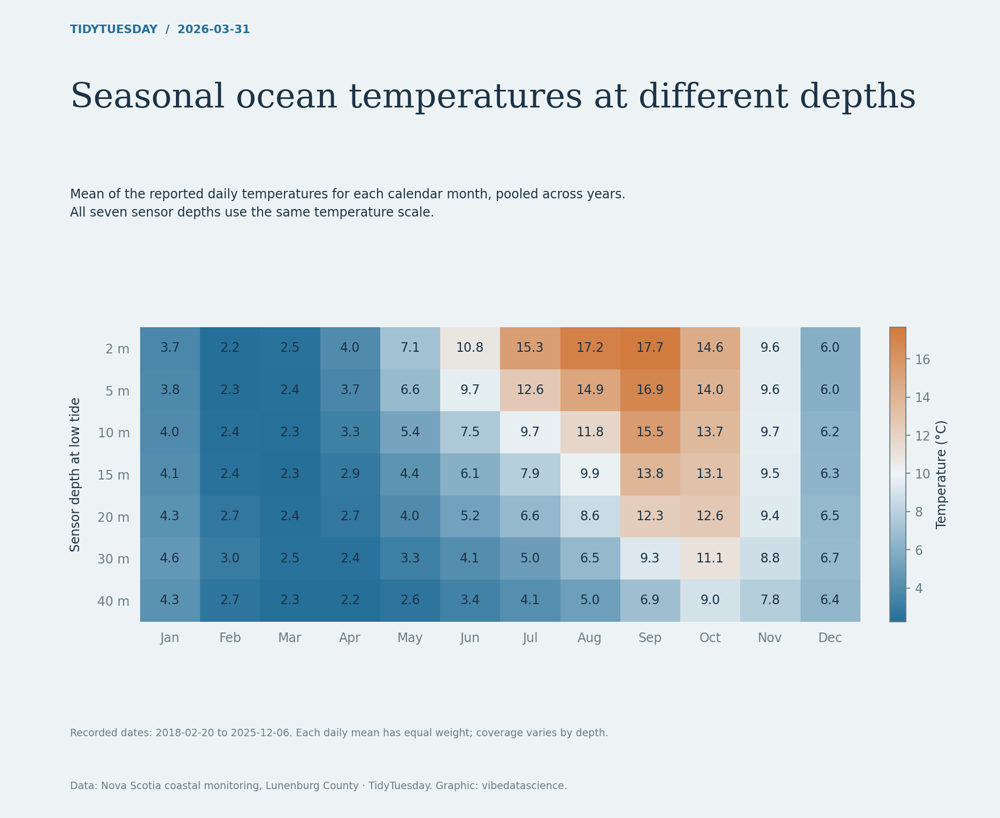

# Seasonal ocean temperatures at different depths

[Python code](20260331.py) · [Source dataset](https://github.com/rfordatascience/tidytuesday/tree/main/data/2026/2026-03-31)

Average reported daily mean temperatures by calendar month and sensor depth, pooled over all years. Each day has equal weight rather than weighting by sensor readings. This describes the observed seasonal cycle; coverage varies and no missing observation is filled.

Data: Nova Scotia coastal monitoring, Lunenburg County. Chart: vibedatascience.

Inputs (original CSV files, losslessly gzip-compressed): [ocean_temperature.csv.gz](data/ocean_temperature.csv.gz)
