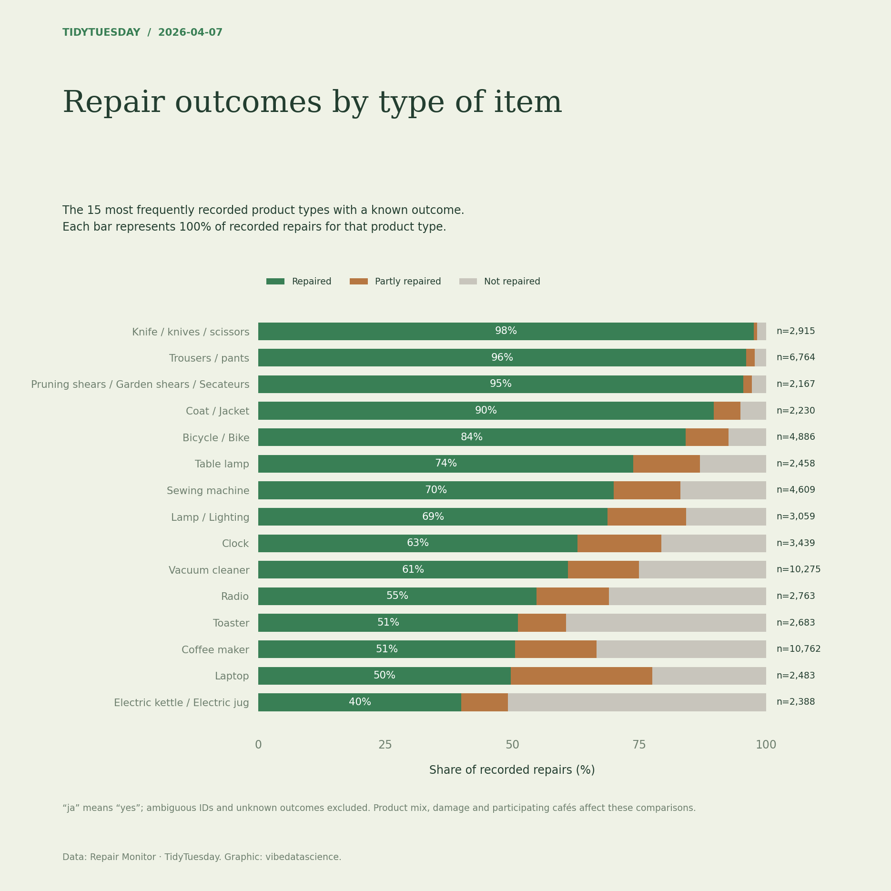

# Repair outcomes by type of item

[Python code](20260407.py) · [Source dataset](https://github.com/rfordatascience/tidytuesday/tree/main/data/2026/2026-04-07)

Exclude all rows with a nonunique repair ID (some IDs refer to different items). Map ja to yes, exclude unknown outcomes, select the 15 most frequent product types, and calculate row-normalised yes/half/no shares. Validate unique repair IDs and shares summing to 100%. These are observed outcomes, not inherent product repairability.

Data: Repair Monitor. Chart: vibedatascience.

Inputs (original CSV files, losslessly gzip-compressed): [repairs.csv.gz](data/repairs.csv.gz)
