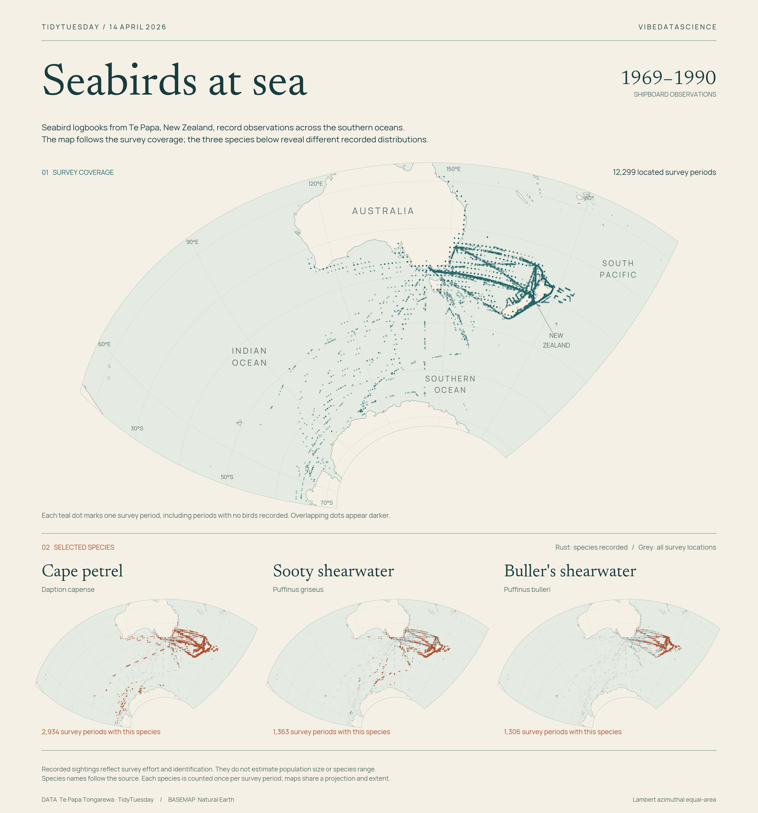

# Seabirds at sea



[Python code](20260414.py) · [Source dataset](https://github.com/rfordatascience/tidytuesday/tree/main/data/2026/2026-04-14)

Shipboard seabird observations from Te Papa Tongarewa, the Museum of New Zealand. The main map shows **12,299 survey periods with valid coordinates**, including periods with no birds recorded. The three smaller maps show recorded locations for Cape petrel, Sooty shearwater and Buller's shearwater against the same survey coverage.

## Read the maps

Every point represents a survey period, not an individual bird. Repeated positions overlap; darker areas can reflect repeated visits. The three species maps share the main map's extent and Lambert azimuthal equal-area projection, centred at 145°E, 43°S. Grey points show all valid survey locations and rust points show periods with the selected species recorded.

These are records of survey effort and sightings, not estimates of abundance, population size or complete species range. The archive includes both full ten-minute counts and partial or casual observations.

## Calculation

- Ship `record_id` values must be unique. Exclude 11 ship records with missing or invalid coordinates or longitude hemisphere, leaving 12,299 of 12,310 survey periods.
- Convert the source's unsigned longitude using its E/W flag. Preserve positions across the international date line.
- Retain no-bird periods in survey coverage. Exclude bird rows with a missing common name from sightings; the source uses those rows for “no birds recorded”.
- Join bird records to valid ship periods. One bird row has no matching ship record and is excluded.
- Select the exact source scientific names `Daption capense`, `Puffinus griseus` and `Puffinus bulleri`. Preserve the source taxonomy. Count each species only once per survey period, even if it has several bird rows.
- The resulting counts are **2,934**, **1,363** and **1,306** periods, respectively. These selected species are examples, not a ranking.

## Reproduce

From the repository root:

```sh
python -m pip install -r requirements.txt
python 2026/2026-04-14/20260414.py
```

The script renders a 3,360 × 3,600 PNG. All data, coastlines and fonts are bundled, so rendering works offline after installing the dependencies.

## Sources and assets

- Observations: [Te Papa / seabirddata](https://jonthegeek.github.io/seabirddata/), distributed through TidyTuesday. Bundled original CSVs, losslessly compressed: [birds.csv.gz](data/birds.csv.gz) · [ships.csv.gz](data/ships.csv.gz).
- Basemap: [Natural Earth 1:50m land](https://www.naturalearthdata.com/downloads/50m-physical-vectors/50m-land/), [public domain](https://www.naturalearthdata.com/about/terms-of-use/). Bundled shapefile components in `assets/`; land is clipped to the plotting region before projection.
- Fonts: [Newsreader](https://github.com/google/fonts/tree/main/ofl/newsreader) and [Manrope](https://github.com/google/fonts/tree/main/ofl/manrope), licensed under the SIL Open Font License. Licences are bundled in `assets/`. Manrope is bundled as a static regular-weight instance of the upstream variable font, created with fontTools; the plot does not require fontTools directly.

Chart: vibedatascience.
