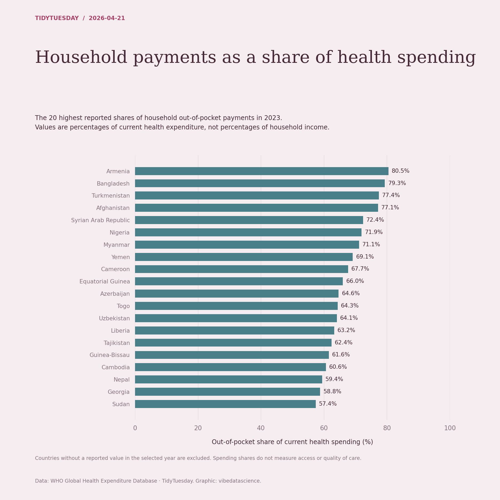

# Household payments as a share of health spending

[Python code](20260421.py) · [Source dataset](https://github.com/rfordatascience/tidytuesday/tree/main/data/2026/2026-04-21)

Use indicator hf3_che (out-of-pocket share of current health expenditure). Select the latest observed year, then the highest 20 nonmissing country values. Do not mix USD values or interpret the share as a household-income burden.

Data: WHO Global Health Expenditure Database. Chart: vibedatascience.

Inputs (original CSV files, losslessly gzip-compressed): [financing_schemes.csv.gz](data/financing_schemes.csv.gz)
