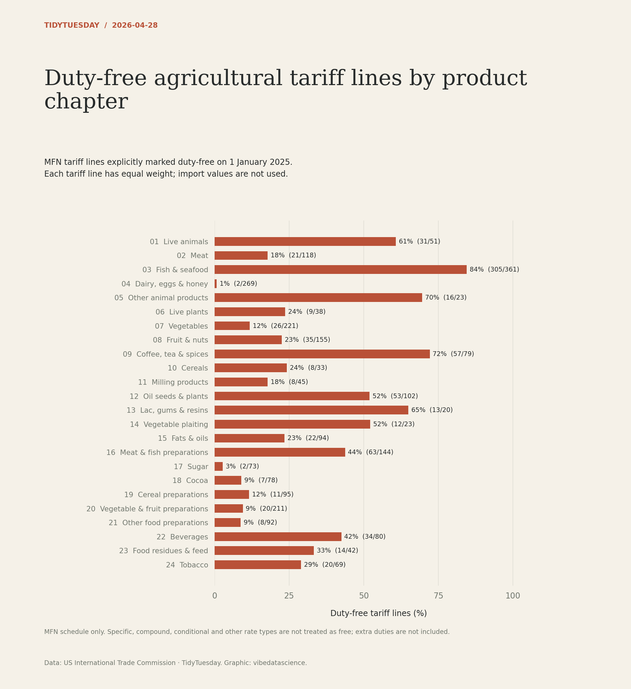

# Duty-free agricultural tariff lines by product chapter

[Python code](20260428.py) · [Source dataset](https://github.com/rfordatascience/tidytuesday/tree/main/data/2026/2026-04-28)

Filter the MFN schedule effective on 2025-01-01; resolve overlapping HTS histories with the most recently effective record. Only rate_type_code=0 is duty-free. Never treat zero ad_val_rate alone as zero total tariff. Report free line counts divided by all lines per chapter, not import-weighted average rates.

Data: US International Trade Commission. Chart: vibedatascience.

Inputs (original CSV files, losslessly gzip-compressed): [tariff_agricultural.csv.gz](data/tariff_agricultural.csv.gz)
