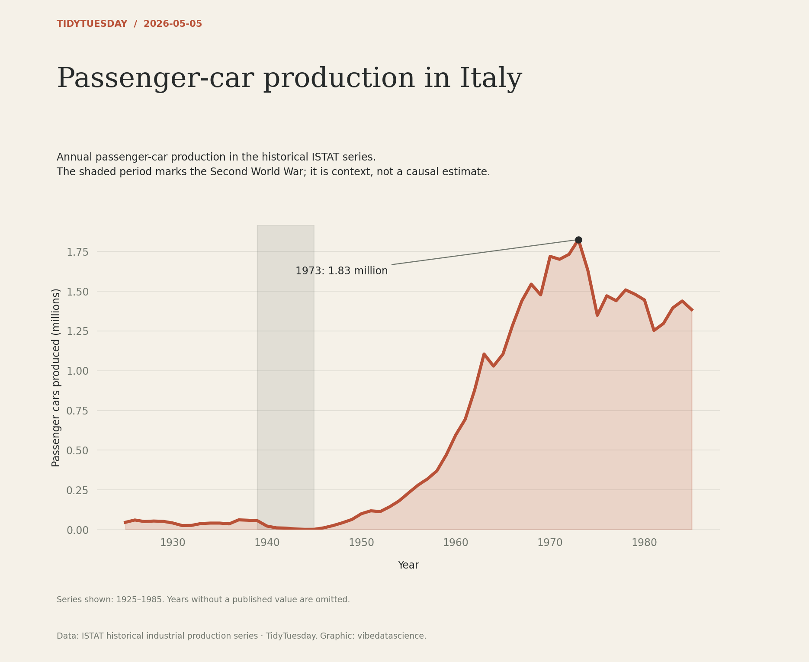

# Passenger-car production in Italy

[Python code](20260505.py) · [Source dataset](https://github.com/rfordatascience/tidytuesday/tree/main/data/2026/2026-05-05)

Plot the passenger-car series in units of vehicles, converted to millions, retaining only reported values. Annotate the observed peak. The war shading provides dates, not attribution of cause.

Data: ISTAT historical industrial production series. Chart: vibedatascience.

Inputs (original CSV files, losslessly gzip-compressed): [transport.csv.gz](data/transport.csv.gz)
