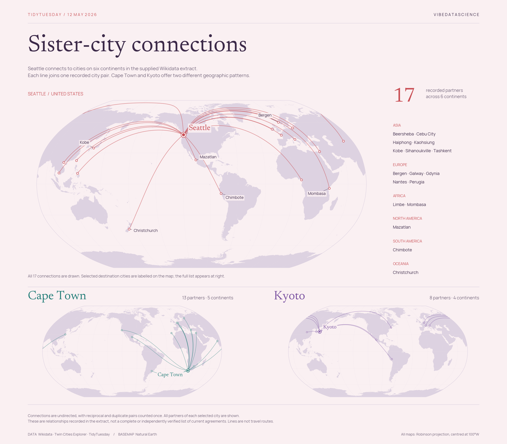

# Sister-city connections



[Python code](20260512.py) · [Source dataset](https://github.com/rfordatascience/tidytuesday/tree/main/data/2026/2026-05-12)

Seattle's recorded city partnerships span six continents in the supplied Wikidata extract. The main map draws every one of its 17 connections and lists all partners beside it. Two smaller maps show Cape Town and Kyoto as geographic comparisons.

| Selected city | Recorded partners | Partner continents |
| --- | ---: | ---: |
| Seattle | 17 | 6 |
| Cape Town | 13 | 5 |
| Kyoto | 8 | 4 |

These cities were selected to show different geographic patterns, not as a ranking of the most connected cities.

## Read the maps

Each curve joins a selected city to one partner in the source data. Small hollow circles mark partners; the larger ring with a filled centre marks the selected city. All three maps use a Robinson projection centred at 100°W, with the same world extent. Curves follow the shortest WGS84 geodesic between supplied city coordinates. They show relationships, **not travel routes or transport services**. Connections crossing the map boundary continue on the opposite side.

The extract is not a complete or independently verified list of current agreements. Relationship dates and current status are not supplied. City and continent labels follow the source.

## Data and checks

- The supplied files contain **5,470 cities** and **10,596 links**. Require unique city IDs and valid coordinates, and check that every link endpoint resolves to a city.
- Treat links as undirected: sort endpoint IDs, collapse duplicate or reciprocal pairs, and exclude self-links. This extract retains all 10,596 links after those steps.
- Select cities by stable Wikidata IDs: Seattle `Q5083`, Cape Town `Q5465`, Kyoto `Q34600`. Include all partners found in either endpoint column, exactly once.
- Assert the partner and continent counts above, and check that Seattle's displayed list exactly matches its mapped partners.
- Sample geodesics, project the points, and split paths at the world-map seam. This avoids false straight lines across the entire map when longitude wraps.

## Reproduce

From the repository root:

```sh
python -m pip install -r requirements.txt
python 2026/2026-05-12/20260512.py
```

Produces a 3,840 × 3,360 PNG. All data, fonts and land geometry are bundled; rendering works offline after installing dependencies.

Data: [Wikidata / Twin Cities Explorer](https://bothness.github.io/twin-cities/), via TidyTuesday. Original CSVs, losslessly compressed: [cities.csv.gz](data/cities.csv.gz) · [links.csv.gz](data/links.csv.gz).

Basemap: [Natural Earth 1:50m land](https://www.naturalearthdata.com/downloads/50m-physical-vectors/50m-land/), [public domain](https://www.naturalearthdata.com/about/terms-of-use/), converted to the bundled `assets/land_50m.geojson.gz`. Fonts: Newsreader and Manrope, with SIL Open Font Licences bundled in `assets/`; Manrope is a static regular-weight instance of the upstream variable font.

Chart: vibedatascience.
