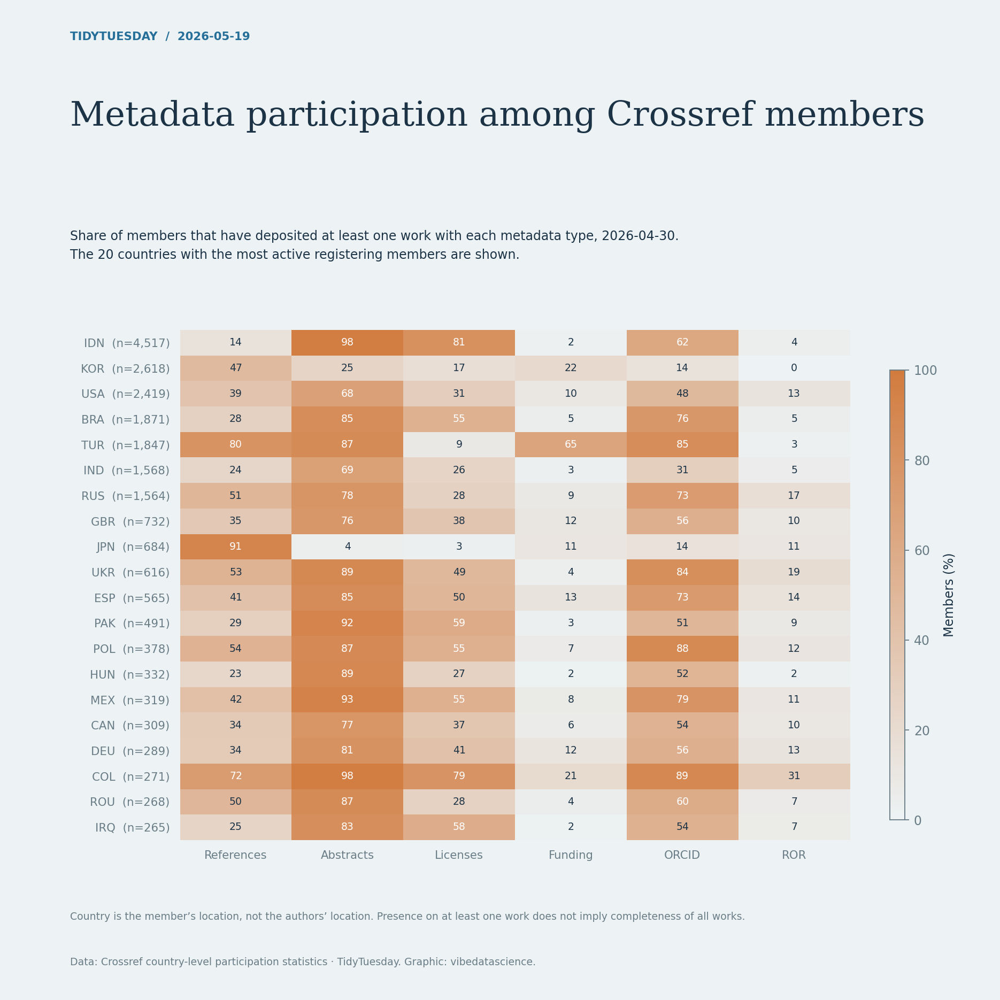

# Metadata participation among Crossref members

[Python code](20260519.py) · [Source dataset](https://github.com/rfordatascience/tidytuesday/tree/main/data/2026/2026-05-19)

Use the latest snapshot and top 20 countries by total_members. Divide each depositing-member count by total_members; validate shares within 0–100. This is member participation, not document-level metadata coverage. Country identifies the registering member.

Data: Crossref country-level participation statistics. Chart: vibedatascience.

Inputs (original CSV files, losslessly gzip-compressed): [member_participation_stats_by_country.csv.gz](data/member_participation_stats_by_country.csv.gz)
