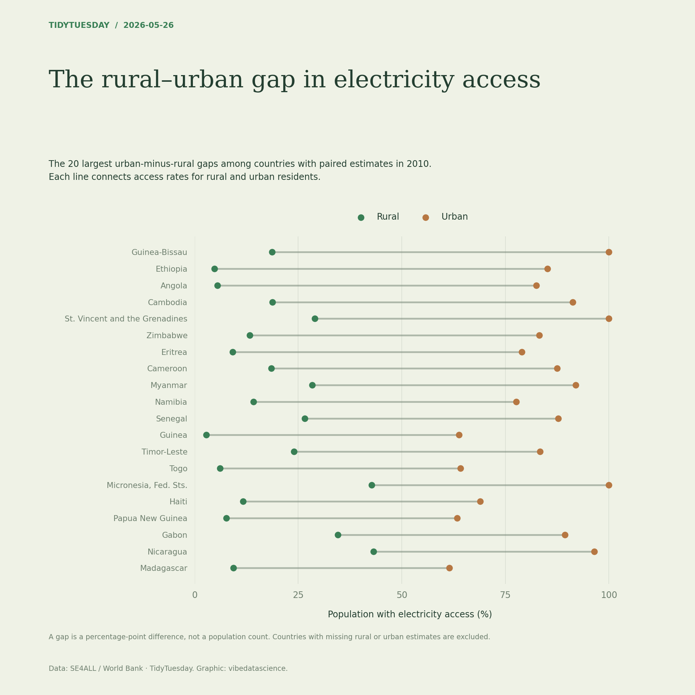

# The rural–urban gap in electricity access

[Python code](20260526.py) · [Source dataset](https://github.com/rfordatascience/tidytuesday/tree/main/data/2026/2026-05-26)

Exclude regional and income-group aggregates, then use the latest year with complete rural/urban access values; select the largest 20 urban-minus-rural gaps. Both measures have their respective resident populations as denominators. Preserve source estimates and exclude missing pairs.

Data: SE4ALL / World Bank. Chart: vibedatascience.

Inputs (original CSV files, losslessly gzip-compressed): [energy_cleaned.csv.gz](data/energy_cleaned.csv.gz)
