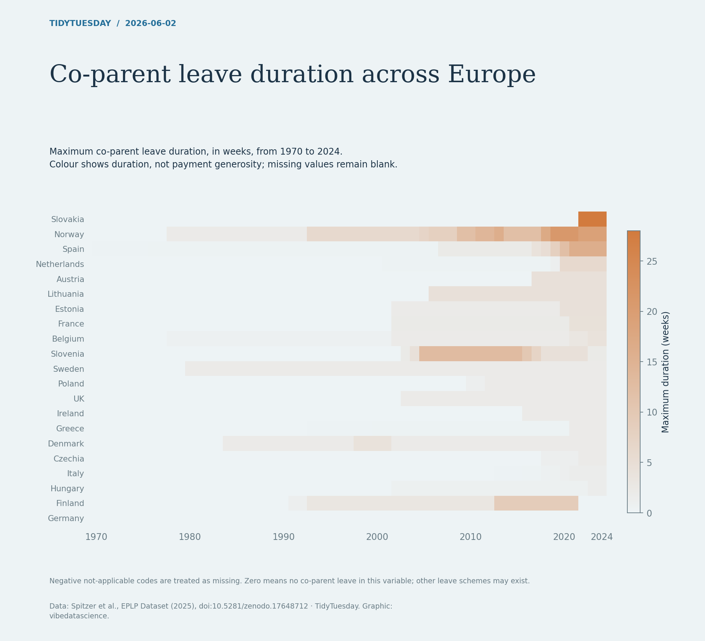

# Co-parent leave duration across Europe

[Python code](20260602.py) · [Source dataset](https://github.com/rfordatascience/tidytuesday/tree/main/data/2026/2026-06-02)

Plot co_ld maximum co-parent leave duration, which the EPLP codebook expresses in weeks. Negative special codes become missing, not zero. The figure makes no claim about pay, eligibility or other maternity/parental schemes.

Data: Spitzer et al., EPLP Dataset (2025), doi:10.5281/zenodo.17648712. Chart: vibedatascience.

Inputs (original CSV files, losslessly gzip-compressed): [eplp.csv.gz](data/eplp.csv.gz)
