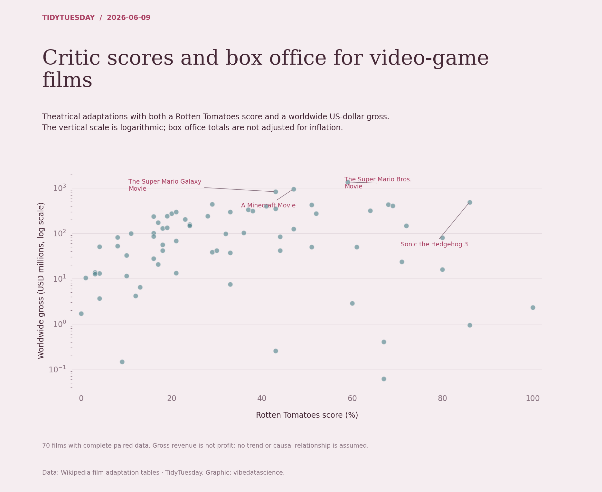

# Critic scores and box office for video-game films

[Python code](20260609.py) · [Source dataset](https://github.com/rfordatascience/tidytuesday/tree/main/data/2026/2026-06-09)

Filter theatrical releases, positive worldwide gross denominated in $, and known Rotten Tomatoes scores. Do not mix yen and USD or interpret revenue as profit. Use a log gross axis; label four largest grosses. No inflation adjustment or regression is applied.

Data: Wikipedia film adaptation tables. Chart: vibedatascience.

Inputs (original CSV files, losslessly gzip-compressed): [game_films.csv.gz](data/game_films.csv.gz)
