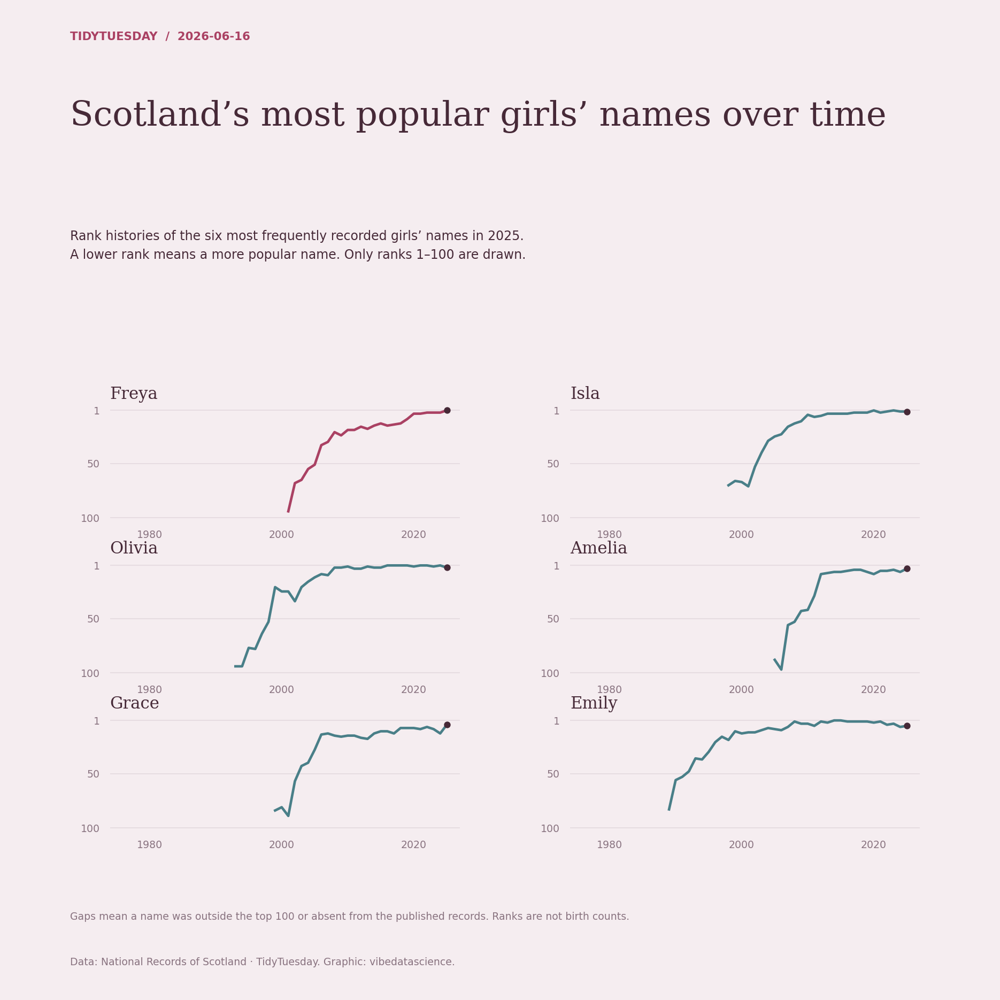

# Scotland’s most popular girls’ names over time

[Python code](20260616.py) · [Source dataset](https://github.com/rfordatascience/tidytuesday/tree/main/data/2026/2026-06-16)

Select six girls’ names with the largest counts in the latest Scottish year, then plot their supplied ranks across all years. Outside-top-100 and absent records are gaps, not zeros. No extrapolation before a name appears.

Data: National Records of Scotland. Chart: vibedatascience.

Inputs (original CSV files, losslessly gzip-compressed): [scotland_names.csv.gz](data/scotland_names.csv.gz)
