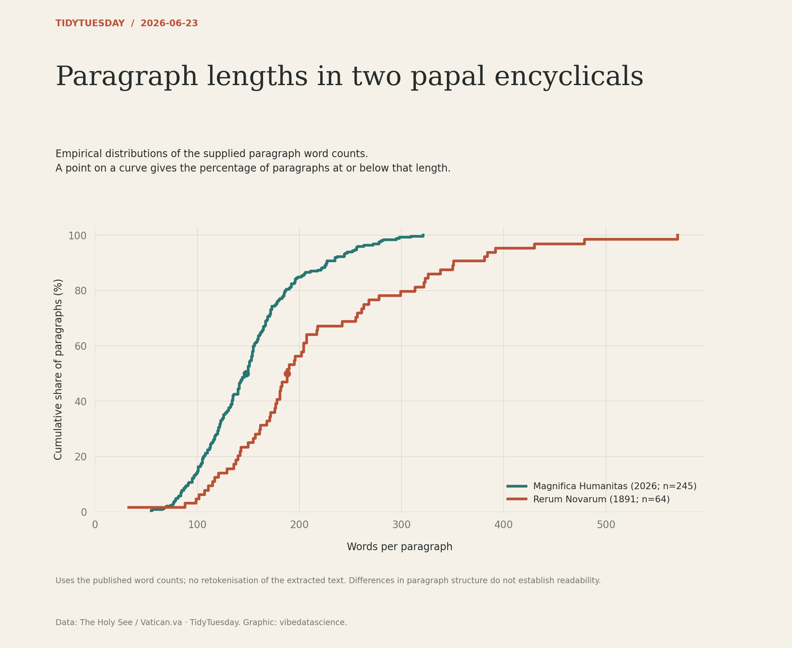

# Paragraph lengths in two papal encyclicals

[Python code](20260623.py) · [Source dataset](https://github.com/rfordatascience/tidytuesday/tree/main/data/2026/2026-06-23)

Use published word_count per paragraph, not a new tokeniser on the imperfectly extracted text. Draw empirical cumulative distributions, labelled with document year and paragraph counts. Curves compare structure, not theological positions or readability.

Data: The Holy See / Vatican.va. Chart: vibedatascience.

Inputs (paragraph metadata and published counts, excluding full text; gzip-compressed): [paragraph_counts.csv.gz](data/paragraph_counts.csv.gz)
