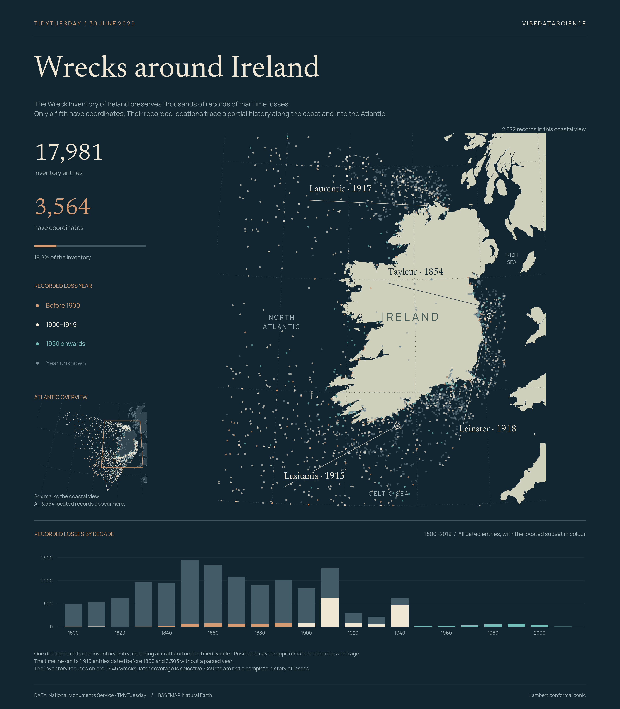

# Wrecks around Ireland



[Python code](20260630.py) · [Source dataset](https://github.com/rfordatascience/tidytuesday/tree/main/data/2026/2026-06-30)

A coastal map of the National Monuments Service Wreck Inventory of Ireland, with an Atlantic overview and a timeline showing the gap between dated records and records with coordinates.

**17,981 inventory entries · 3,564 with coordinates (19.8%) · 2,872 in the coastal view.**

## Read the chart

One dot represents one inventory entry. Colours show the supplied loss year: before 1900, 1900–1949, 1950 onwards, or unknown. Positions can overlap, be approximate, or refer to wreckage rather than a verified seabed site. Aircraft and unidentified wrecks remain included, consistent with the inventory's scope.

The main map covers 13.5°W–4.5°W and 50°N–56.5°N. The overview includes all 3,564 located records; its box indicates the coastal region. Both maps use a Lambert conformal conic projection centred at 9°W, 53°N, with standard parallels at 49°N and 57°N.

The timeline compares all **12,768 entries dated 1800–2019** (grey bars) with the **1,886 that also have coordinates** (coloured portions). It excludes 1,910 earlier entries and 3,303 without a parsed year. **The inventory concentrates on pre-1946 losses, with selective later coverage**, so the drop in later decades must not be read as a trend in maritime safety.

## Data checks

- Require unique `wreck_no` identifiers. Retain valid, nonzero coordinate pairs; never infer missing locations. All 3,564 supplied coordinate pairs pass the range checks.
- Use the upstream `year` field, derived from parsed loss dates. Descriptive dates that were not parsed remain unknown; no century is imputed.
- Keep all 17,981 inventory entries in the totals, including undated and unlocated records. Exactly 692 located records fall outside the coastal view and appear in the overview.
- Annotate stable inventory IDs: **Tayleur** `W00805` (1854), **Leinster** `W02039` (1918), **Laurentic** `W07428` (1917), and **Lusitania** `W08561` (1915). This distinguishes vessels that share names. Coordinates and years follow the source records; the annotations do not assert exact sinking dates.

## Reproduce

From the repository root:

```sh
python -m pip install -r requirements.txt
python 2026/2026-06-30/20260630.py
```

Produces a 3,360 × 3,840 PNG. Rendering works offline after installing the dependencies.

Data: [National Monuments Service Wreck Inventory](https://www.archaeology.ie/advice-and-support/locate-a-monument-or-wreck/wreck-viewer/), via TidyTuesday. Original CSV, losslessly compressed: [wreck_inventory.csv.gz](data/wreck_inventory.csv.gz).

Basemap: [Natural Earth 1:10m land](https://www.naturalearthdata.com/downloads/10m-physical-vectors/10m-land/), [public domain](https://www.naturalearthdata.com/about/terms-of-use/). The bundled `assets/land_10m.geojson.gz` is clipped to 28°W–2°W, 44°N–60°N from the source land polygons. Fonts: Newsreader and Manrope, with their SIL Open Font Licences bundled in `assets/`; Manrope is a static regular-weight instance of the upstream variable font.

Chart: vibedatascience.
