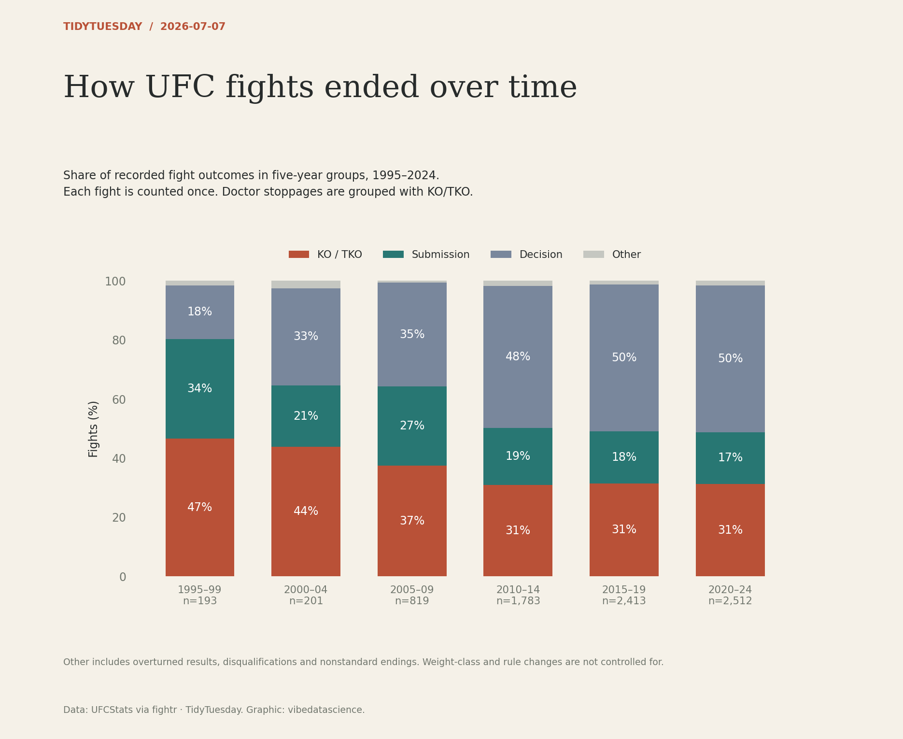

# How UFC fights ended over time

[Python code](20260707.py) · [Source dataset](https://github.com/rfordatascience/tidytuesday/tree/main/data/2026/2026-07-07)

Deduplicate fight_url; use complete five-year periods 1995–2024. Group decision subtypes; group KO/TKO and doctor stoppage; retain other outcomes separately. Row shares must total 100%. This is descriptive across changing rules and competitors.

Data: UFCStats via fightr. Chart: vibedatascience.

Inputs (original CSV files, losslessly gzip-compressed): [ufc_fights.csv.gz](data/ufc_fights.csv.gz)
