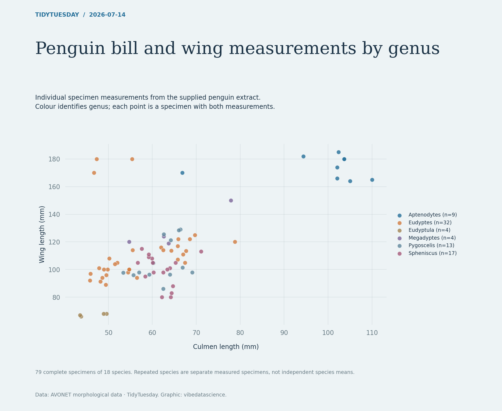

# Penguin bill and wing measurements by genus

[Python code](20260714.py) · [Source dataset](https://github.com/rfordatascience/tidytuesday/tree/main/data/2026/2026-07-14)

Complete positive culmen-length and wing-length pairs only. Display individual specimens by genus. Do not confuse repeated specimens with species-level samples or infer a population relationship from this small collection.

Data: AVONET morphological data. Chart: vibedatascience.

Inputs (original CSV files, losslessly gzip-compressed): [many_penguins.csv.gz](data/many_penguins.csv.gz)
