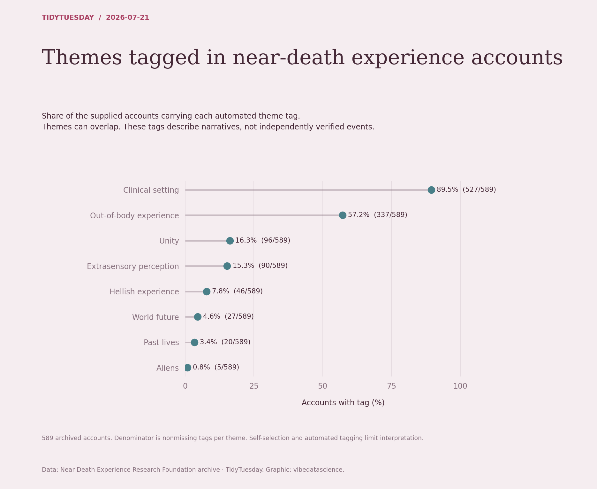

# Themes tagged in near-death experience accounts

[Python code](20260721.py) · [Source dataset](https://github.com/rfordatascience/tidytuesday/tree/main/data/2026/2026-07-21)

For each boolean ai_* tag, calculate true / nonmissing entries, with exact counts shown. Themes overlap, so percentages do not sum to 100%. Accounts and automated labels are not independent verification of extraordinary experiences.

Data: Near Death Experience Research Foundation archive. Chart: vibedatascience.

Inputs (original CSV files, losslessly gzip-compressed): [nde_experiences.csv.gz](data/nde_experiences.csv.gz)
