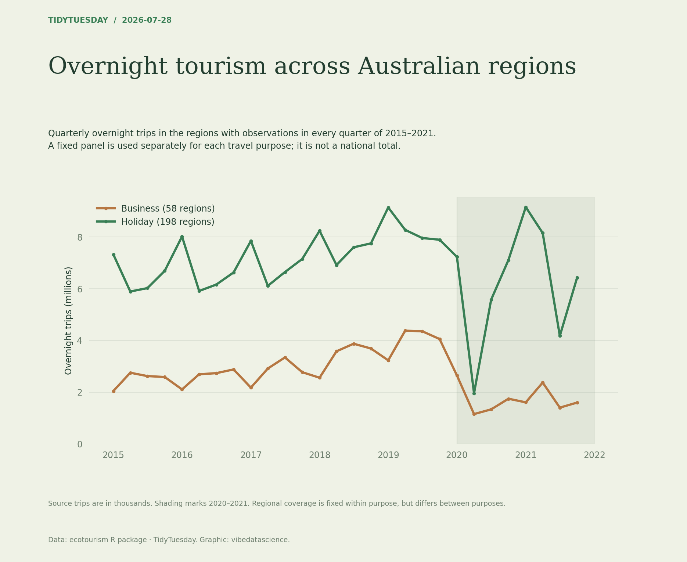

# Overnight tourism across Australian regions

[Python code](20260728.py) · [Source dataset](https://github.com/rfordatascience/tidytuesday/tree/main/data/2026/2026-07-28)

Use 2015–2021 complete-year quarters. Select regions with all 28 observations separately for Business and Holiday, then sum source trip estimates (thousands) and divide by 1000 for millions. Assert unique region/year/quarter/purpose keys. These fixed-panel totals are not all-Australia estimates.

Data: ecotourism R package. Chart: vibedatascience.

Inputs (original CSV files, losslessly gzip-compressed): [tourism.csv.gz](data/tourism.csv.gz)
