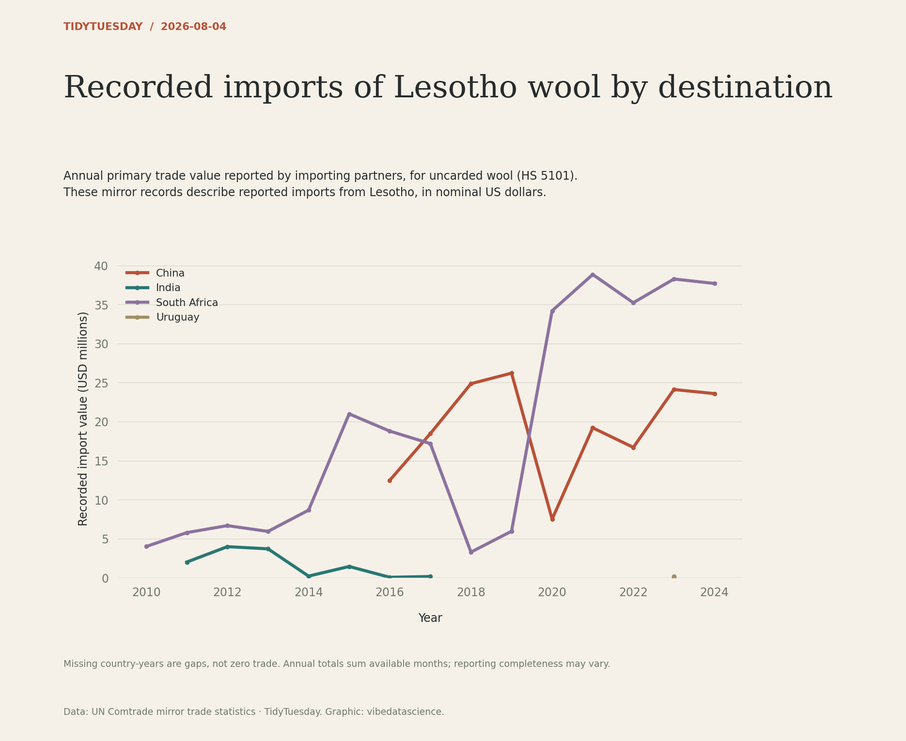

# Recorded imports of Lesotho wool by destination

[Python code](20260804.py) · [Source dataset](https://github.com/rfordatascience/tidytuesday/tree/main/data/2026/2026-08-04)

Restrict to import flow M and HS 5101, excluding wool-waste HS 5103. Validate unique partner/year/month/product keys and sum primary_value by reporter/year. Keep unobserved country-years missing and disclose incomplete-month coverage. Values are nominal USD, not quantities or Lesotho customs exports.

Data: UN Comtrade mirror trade statistics. Chart: vibedatascience.

Inputs (original CSV files, losslessly gzip-compressed): [basotho_wool.csv.gz](data/basotho_wool.csv.gz)
