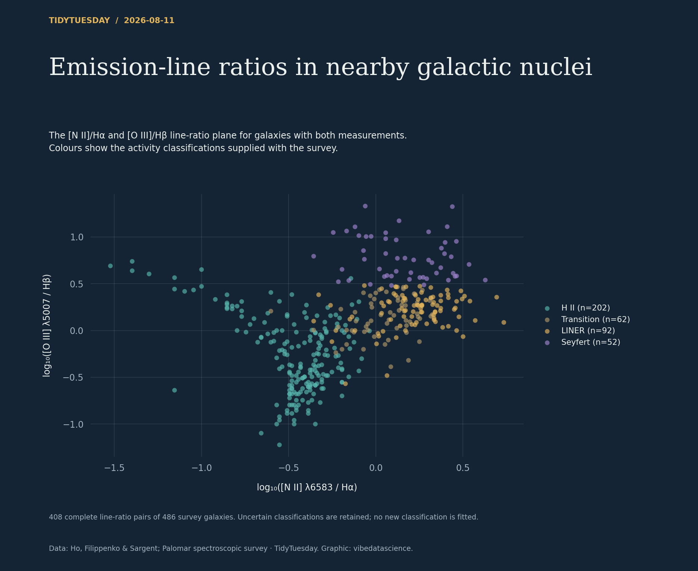

# Emission-line ratios in nearby galactic nuclei

[Python code](20260811.py) · [Source dataset](https://github.com/rfordatascience/tidytuesday/tree/main/data/2026/2026-08-11)

The log_nii_ha and log_oiii_hb column names are misleading: the data dictionary and cleaning script identify linear intensity ratios. Verify positivity and take log10 explicitly, after dropping missing pairs. Colour by the supplied activity_type, retaining uncertain classifications. No imputation, classification boundary fitting or independent reclassification.

Data: Ho, Filippenko & Sargent; Palomar spectroscopic survey. Chart: vibedatascience.

Inputs (original CSV files, losslessly gzip-compressed): [palomar_survey.csv.gz](data/palomar_survey.csv.gz)
