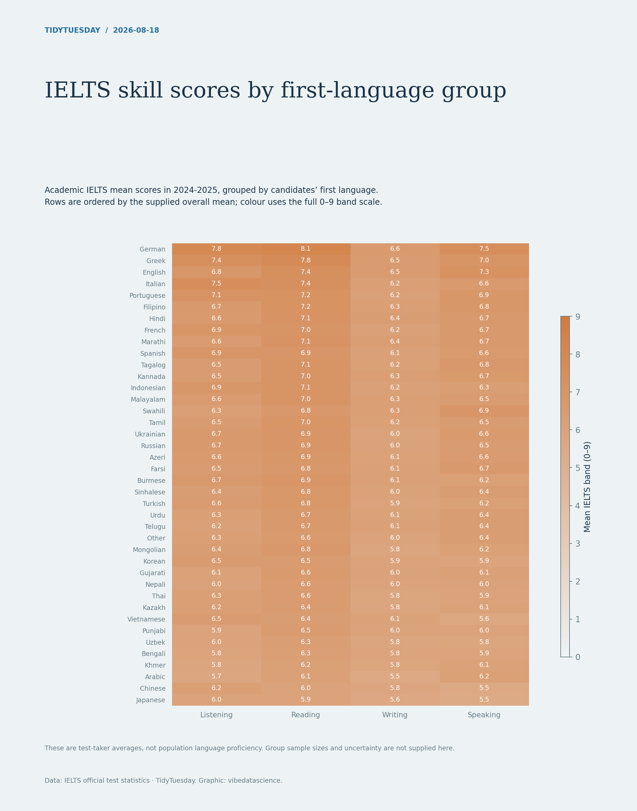

# IELTS skill scores by first-language group

[Python code](20260818.py) · [Source dataset](https://github.com/rfordatascience/tidytuesday/tree/main/data/2026/2026-08-18)

Select Academic tests in the latest year label. Pivot all supplied language groups by skill and sort by the separately supplied overall mean. Do not average group scores or interpret candidate averages as national or population proficiency. Show full 0–9 colour scale.

Data: IELTS official test statistics. Chart: vibedatascience.

Inputs (original CSV files, losslessly gzip-compressed): [performance_by_first_language.csv.gz](data/performance_by_first_language.csv.gz)
