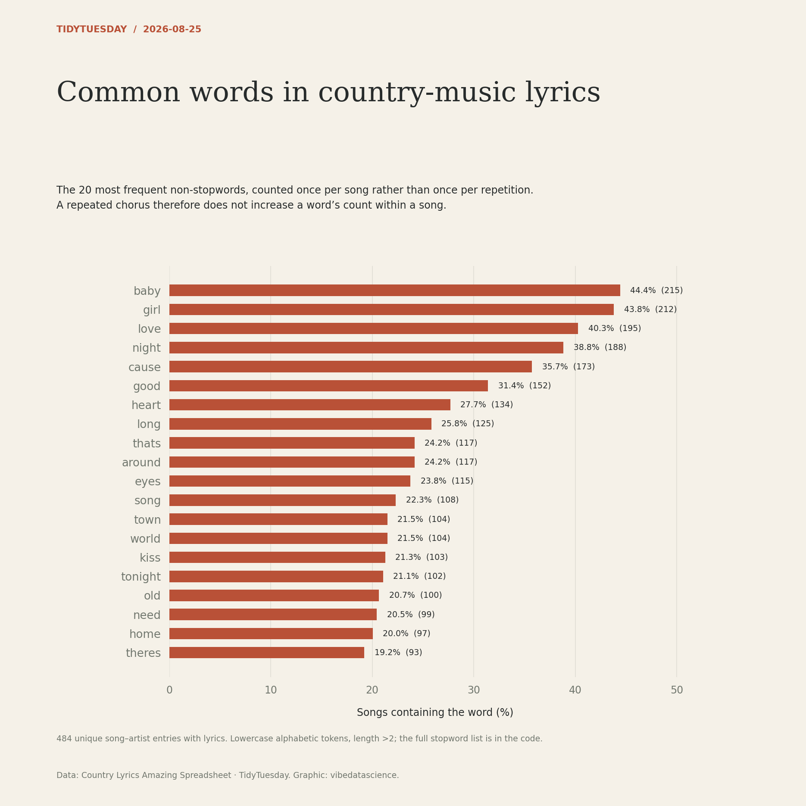

# Common words in country-music lyrics

[Python code](20260825.py) · [Source dataset](https://github.com/rfordatascience/tidytuesday/tree/main/data/2026/2026-08-25)

Deduplicate song/artist and use songs with lyrics. Lowercase alphabetic tokens with internal apostrophes preserved during tokenisation, then strip the apostrophes (so don’t becomes dont, a stopword). Remove tokens of length ≤2 and apply the explicit stopword list, including aint. Count token presence once per song, not repeated lyric occurrences. Display top 20 by song frequency. No lyrics are reproduced in the chart.

Data: Country Lyrics Amazing Spreadsheet. Chart: vibedatascience.

The script reads the original lyrics CSV from the source URL when no local analysis copy exists. Full lyrics are not mirrored in this repository.
