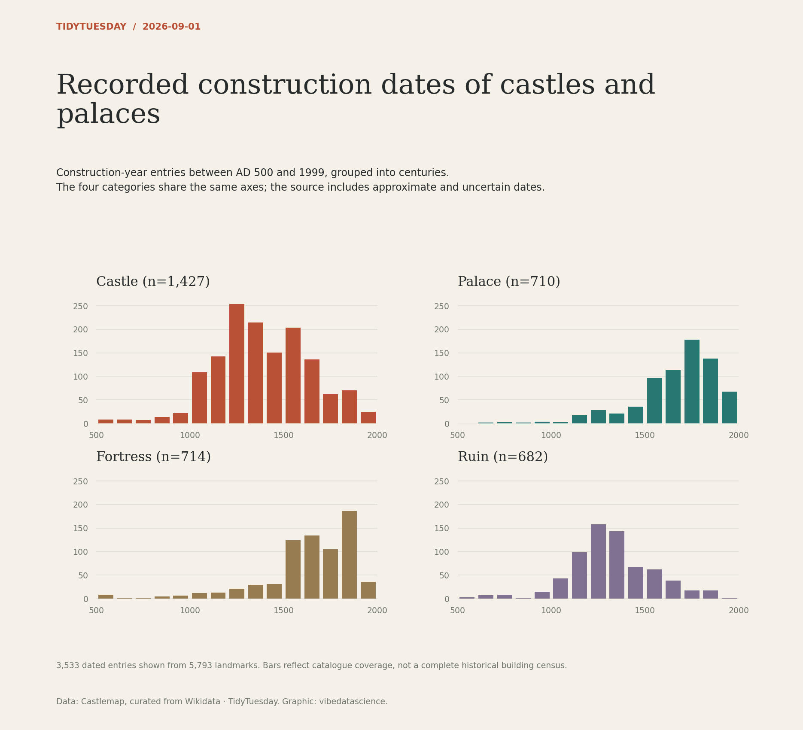

# Recorded construction dates of castles and palaces

[Python code](20260901.py) · [Source dataset](https://github.com/rfordatascience/tidytuesday/tree/main/data/2026/2026-09-01)

One record per Wikidata QID. Restrict supplied construction years to AD 500–1999 and bin into equal 100-year intervals. Four category panels share a common count scale. Preserve approximate years but explain dating uncertainty and catalogue coverage.

Data: Castlemap, curated from Wikidata. Chart: vibedatascience.

Inputs (original CSV files, losslessly gzip-compressed): [world_castles.csv.gz](data/world_castles.csv.gz)
