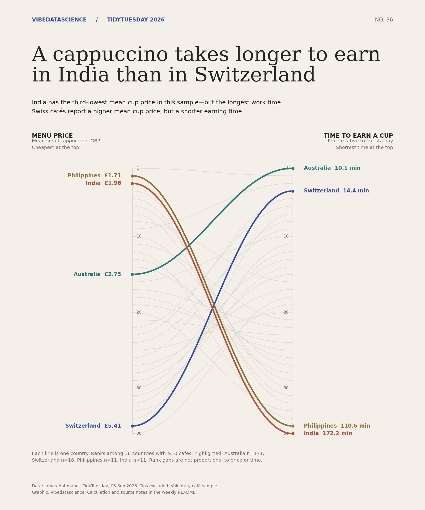

# The Cappuccino Index

[Plotting code](20260908.py) · [TidyTuesday data](https://github.com/rfordatascience/tidytuesday/tree/main/data/2026/2026-09-08)

The chart compares mean cup-price ranks with earning-time ranks for the 36 countries with at least 10 café responses. Minutes per cup = `60 × sum(prices) / sum(hourly wages)`. The script checks all 87 country indices against the published data before plotting.

The data are voluntary café responses, not representative national estimates. Tips are excluded. Rank gaps show order, not differences in magnitude.

Data: James Hoffmann; curated for TidyTuesday by Filip Reierson. Chart and code: vibedatascience.
